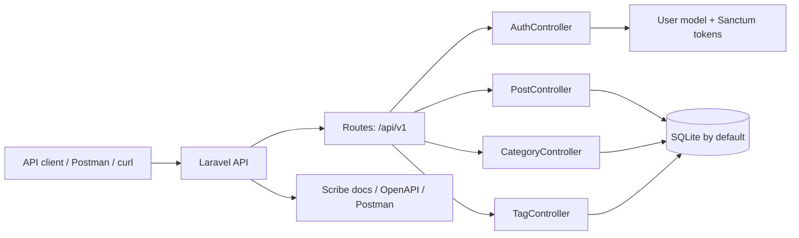

# Muse n’ Drafts

A personal Laravel API for writing, organizing, and exploring draft-style content. The project name reflects the idea that you muse before you draft: it is a small API for note-taking, blog-like entries, and experimenting with API design in a Laravel application.

This repository is intentionally modest and evolving. It is a learning project and a portfolio-style API rather than a production platform or a large commercial system.

## Current status

This API is a working Laravel 13 project with:

- user registration/login/logout via Laravel Sanctum
- authenticated and unauthenticated routes for posts, categories, and tags
- CRUD-style endpoints for content resources
- token abilities tied to user roles
- Scribe-based API documentation setup
- a Postman collection saved in the repo

The feature set is focused, but the structure is already enough to explore real API design patterns in Laravel.

## Project concept

Muse n’ Drafts is a lightweight blog-style API where a user can create posts and associate them with categories and tags. The project exists as a practical learning surface for Laravel routing, validation, authorization, database relationships, and API documentation.

The name keeps the tone personal and reflective without pretending the project is more mature than it is.

## Architecture at a glance



This is a simple API-first Laravel app: routes delegate to controllers, controllers use request validation and policy checks, and the application persists content in the database.

## Technology stack

- PHP 8.3+
- Laravel 13
- Laravel Sanctum for API tokens
- SQLite in the default local setup
- Eloquent models and migrations
- Laravel Scribe for API documentation generation
- Pest for the test suite
- Vite for frontend asset bundling

## Repository structure

- `app/Http/Controllers/API/V1` — API controllers for auth, posts, categories, and tags
- `app/Http/Requests/API/V1` — request validation rules
- `app/Http/Resources/API/V1` — resource serialization for JSON responses
- `app/Models` — `User`, `Post`, `Category`, and `Tag`
- `app/Policies` — authorization checks for CRUD actions
- `app/Permissions/V1/TokenAbilities.php` — token scope definitions
- `database/migrations` — database schema definitions
- `database/seeders` — demo seed data
- `routes/api/v1.php` — API route registration
- `config/scribe.php` — Scribe configuration for docs generation
- `.readme/Muse n' Drafts.postman_collection.json` — Postman collection for local testing

## Features currently implemented

### Authentication

The application includes a basic authentication flow:

- `POST /api/v1/register`
- `POST /api/v1/login`
- `POST /api/v1/logout` (requires a valid Sanctum token)

Registration creates a user with the role `reader` by default. Tokens are created with abilities derived from the user role via `TokenAbilities::getAbilities()`.

### Posts

The API supports a blog-like post resource:

- `GET /api/v1/posts` — list posts
- `GET /api/v1/posts/{post}` — view a single post
- `POST /api/v1/posts` — create a post
- `PATCH /api/v1/posts/{post}` — update a post
- `PUT /api/v1/posts/{post}` — replace a post
- `DELETE /api/v1/posts/{post}` — delete a post

Posts are associated with:

- a category
- one or more tags
- an author (`author_id`)

The response objects follow a resource-style structure with `type`, `id`, and `attributes` keys.

### Categories

- `GET /api/v1/categories`
- `GET /api/v1/categories/{category}`
- `POST /api/v1/categories`
- `PATCH /api/v1/categories/{category}`
- `PUT /api/v1/categories/{category}`
- `DELETE /api/v1/categories/{category}`

Categories are stored as a unique `name` plus the user who created them.

### Tags

- `GET /api/v1/tags`
- `GET /api/v1/tags/{tag}`
- `POST /api/v1/tags`
- `PATCH /api/v1/tags/{tag}`
- `PUT /api/v1/tags/{tag}`
- `DELETE /api/v1/tags/{tag}`

Tags are also unique by `name` and are linked to posts through a pivot table.

### Querying

The posts endpoint accepts a few query params:

- `search`
- `category`
- `tag`
- `sort`
- `page`

The current implementation is intentionally lightweight and still evolving; it is best treated as a practical starting point, not a fully polished query layer.

## Getting started

### Prerequisites

- PHP 8.3+
- Composer
- Node.js/npm (for the default Laravel Vite asset setup)
- SQLite support enabled in your local PHP environment

### Installation

```bash
composer install
cp .env.example .env
php artisan key:generate
php artisan migrate --seed
npm install
npm run build
php artisan serve
```

The project defaults to SQLite in `.env.example`, so local development is straightforward when using the default setup.

## Environment configuration

The repository includes `.env.example` with the expected Laravel config. The default values are:

```env
APP_NAME="Muse n' Drafts"
APP_ENV=local
APP_URL=http://localhost:8000
DB_CONNECTION=sqlite
SESSION_DRIVER=database
CACHE_STORE=database
QUEUE_CONNECTION=database
```

Make sure you keep your local `.env` file out of source control. This repo already includes `.env` in `.gitignore`.

## Database setup

The default local database is SQLite, with the database file created as part of the standard Laravel setup. The following tables are included by the current migrations:

- `users`
- `password_reset_tokens`
- `sessions`
- `posts`
- `categories`
- `tags`
- `post_tag`
- `personal_access_tokens` (from Sanctum)

The seeders generate users, posts, categories, and tags so the API can be explored quickly.

## Running the API

Start the Laravel server:

```bash
php artisan serve
```

Then use the API at:

```text
http://127.0.0.1:8000/api/v1
```

If you want the Vite frontend pipeline to stay in sync with the default Laravel app setup, also run:

```bash
npm run dev
```

## Authentication

The API uses Laravel Sanctum tokens.

### Register

```bash
curl -X POST http://127.0.0.1:8000/api/v1/register \
  -H "Accept: application/json" \
  -H "Content-Type: application/json" \
  -d '{
    "name": "Avery Reader",
    "email": "reader@example.com",
    "password": "password123",
    "password_confirmation": "password123"
  }'
```

### Login

```bash
curl -X POST http://127.0.0.1:8000/api/v1/login \
  -H "Accept: application/json" \
  -H "Content-Type: application/json" \
  -d '{
    "email": "reader@example.com",
    "password": "password123"
  }'
```

The response includes a token:

```json
{
    "message": "Authenticated",
    "data": {
        "token": "<sanctum-token>"
    },
    "status": 200
}
```

Use the token as a bearer token for authenticated routes:

```bash
curl -X GET http://127.0.0.1:8000/api/v1/posts \
  -H "Accept: application/json" \
  -H "Authorization: Bearer <sanctum-token>"
```

### Logout

```bash
curl -X POST http://127.0.0.1:8000/api/v1/logout \
  -H "Accept: application/json" \
  -H "Authorization: Bearer <sanctum-token>"
```

## API usage

### List posts

```bash
curl -X GET "http://127.0.0.1:8000/api/v1/posts?sort=-id" \
  -H "Accept: application/json"
```

### Create a post

```bash
curl -X POST http://127.0.0.1:8000/api/v1/posts \
  -H "Accept: application/json" \
  -H "Authorization: Bearer <sanctum-token>" \
  -H "Content-Type: application/json" \
  -d '{
    "data": {
      "attributes": {
        "title": "A first draft",
        "content": "A short reflection on writing and editing.",
        "category": "Essays",
        "tags": ["Craft", "Writing"]
      }
    }
  }'
```

### Example post response

```json
{
    "type": "post",
    "id": 1,
    "attributes": {
        "title": "A first draft",
        "content": "A short reflection on writing and editing.",
        "category": "Essays",
        "tags": ["Craft", "Writing"],
        "createdAt": "2026-09-14T12:00:00.000000Z",
        "updatedAt": "2026-09-14T12:00:00.000000Z"
    }
}
```

### Example category response

```json
{
    "type": "category",
    "id": 2,
    "attributes": {
        "name": "Essays",
        "noOfPosts": 5,
        "createdAt": "2026-09-14T12:00:00.000000Z",
        "updatedAt": "2026-09-14T12:00:00.000000Z"
    }
}
```

## Validation and error behavior

The app uses Laravel form requests for validation and a simple API response trait for JSON output.

On success, responses are shaped like:

```json
{
  "message": "Authenticated",
  "data": { ... },
  "status": 200
}
```

On validation or auth errors, the API returns Laravel validation errors or a simple message/status payload. For example:

```json
{
    "message": "Invalid Credentials: Try Again!",
    "status": 404
}
```

Relevant validation rules include:

- posts require a `title`, `content`, and existing `category` name
- `tags` may be supplied as an array of up to 4 unique tag names
- category and tag names are unique strings with a maximum length of 10 characters
- registration requires `name`, `email`, and a confirmed password with a minimum of 8 characters
- login requires both `email` and `password`

## API docs and Postman collection

Scribe is configured in `config/scribe.php` and the project is set up to generate API documentation and a Postman collection. The repository includes a local Postman export at:

```text
.readme/Muse n' Drafts.postman_collection.json
```

### Importing the collection

1. Open Postman.
2. Import the collection from `.readme/Muse n' Drafts.postman_collection.json`.
3. Add a local environment with variables such as:
    - `{{base_url}}` → `http://127.0.0.1:8000`
    - `{{AUTH_TOKEN}}` → a valid token returned from `/api/v1/login`
4. Update the collection requests to use the environment values as needed.

The provided collection already includes example local values such as `sanelights@journal.com` and `password`, which are useful for local experimentation but should not be treated as production credentials.

## Testing

The project includes a minimal Laravel test setup with Pest. The first smoke test confirms the app responds successfully at the root route.

Run the tests with:

```bash
php artisan test
```

or the shorter compact form:

```bash
php artisan test --compact
```

There is not yet a broad API test suite covering every endpoint or edge case, so this area is still a natural place to grow.

## Documentation notes

This repo contains the Scribe configuration for generated API docs, which is a good fit for a project like this because the API is the main product surface. In a typical local workflow, you would generate docs with Scribe and then review the output in a browser.

The project is in a sensible stage for a README to document the current API clearly while telling the truth about its maturity.

## Likely development direction

The current implementation is intentionally modest. The likely next stage is to strengthen the existing API so the current concepts are more complete, consistent, and better covered by tests and validation.

That could mean:

- broadening resource coverage and consistency
- tightening authorization rules and role behavior
- improving validation and error handling
- expanding the API test suite
- improving document generation and Postman coverage
- cleaning up inconsistencies in naming and implementation details

Beyond that probable midpoint, the project may evolve further as the author learns more about Laravel, API design, testing, and practical application needs.

## Visual directions for a future logo or header

There is no logo or banner in the repo yet, so these are directions for a future design rather than an existing asset.

### 1. Ink and spark

- A subtle quill or pen nib with a small spark or star above it
- Colors: warm ivory, charcoal, muted gold
- Why it fits: simple, writerly, and understated without feeling corporate

### 2. Page-to-thought transformation

- A clean manuscript page that gradually resolves into a soft, elegant line or draft mark
- Use a thin serif letterform or editorial layout feel
- Why it fits: it mirrors the idea of musings becoming structure and then a draft

### 3. Minimal muse mark

- A single abstract “M” or a stylized quill-form icon inspired by a muse or inspiration spark
- Slightly editorial, modern, and refined
- Why it fits: keeps the wordplay subtle and mature rather than gimmicky

### 4. Quote-and-draft motif

- Open quotation marks framing a page or pen stroke
- Soft neutral palette with one accent tone
- Why it fits: it nods to writing, reflection, and the project’s “muse before draft” concept without becoming cartoonish

If a logo or banner is added later, sensible files would be:

- `docs/images/logo.svg`
- `docs/images/banner.svg`

A banner could sit beneath the title near the top of the README, while a small logo can appear in the project header or docs layout.

## License

No license file is currently present in this repository. If this project is intended to be shared publicly, a license should be chosen before it is published broadly.

## Closing note

Muse n’ Drafts is best understood as an evolving personal API and an exercise in building a thoughtful Laravel backend with real database relationships, authentication, and documentation. It is not presented here as a finished enterprise platform; it is a current and honest snapshot of an ongoing project.
